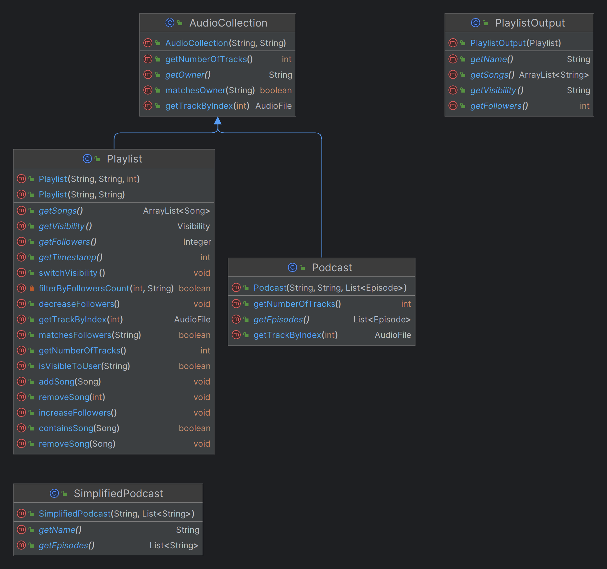
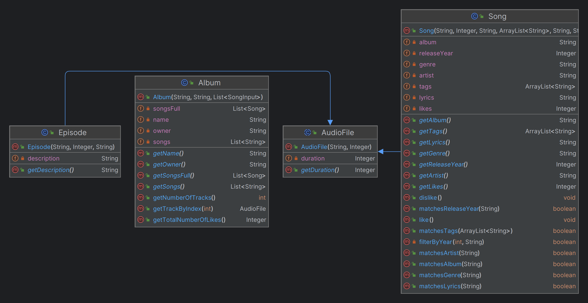
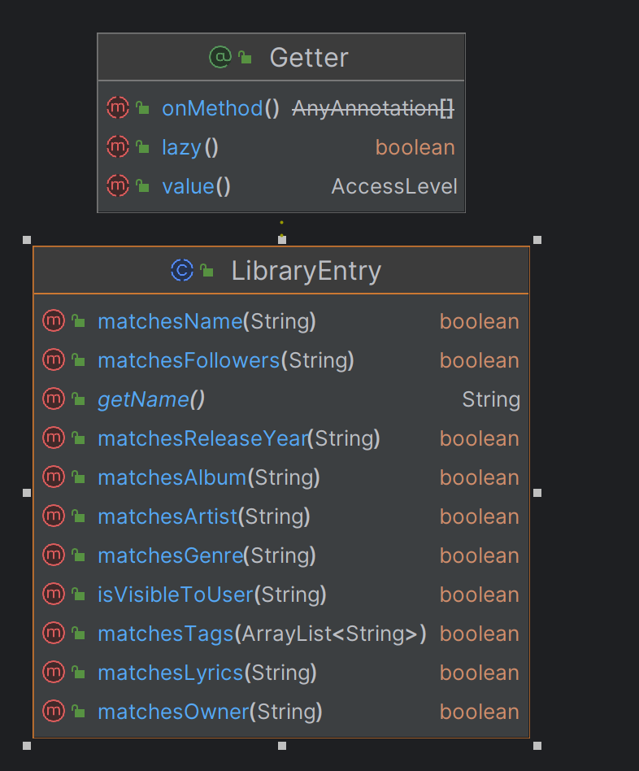
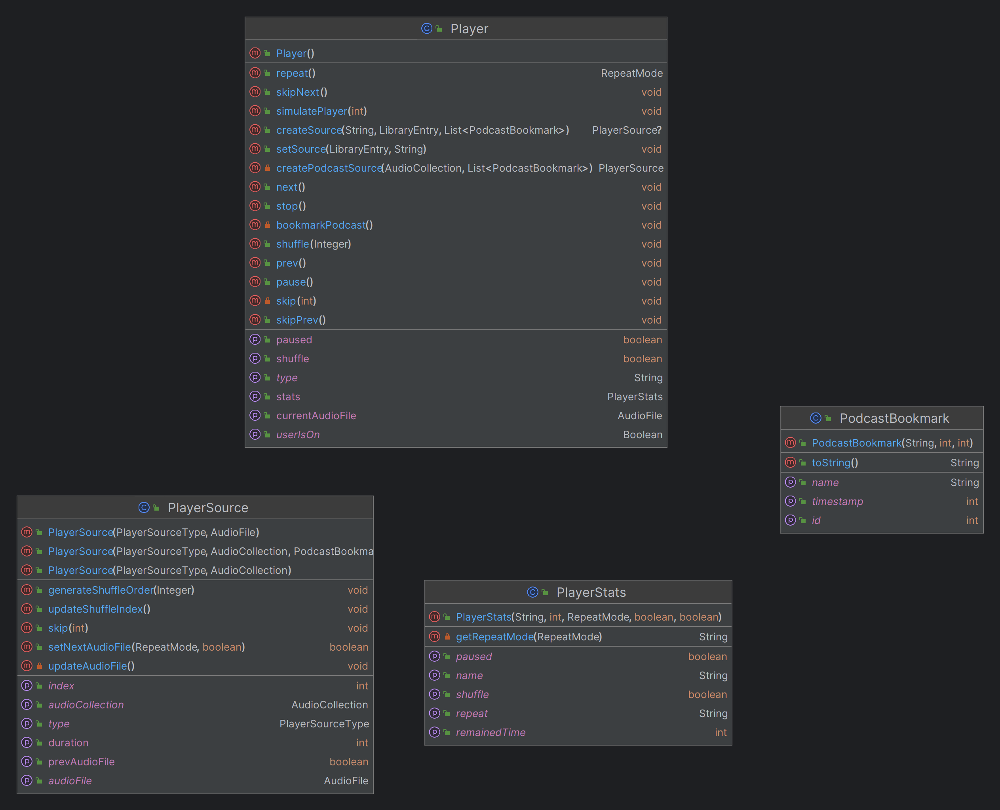
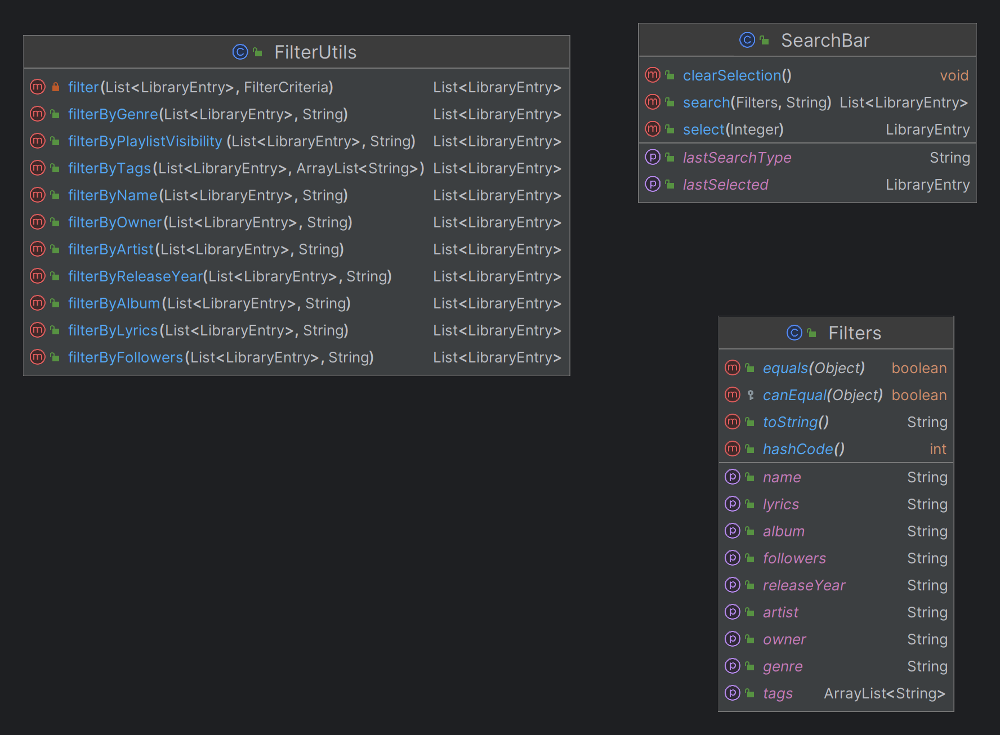
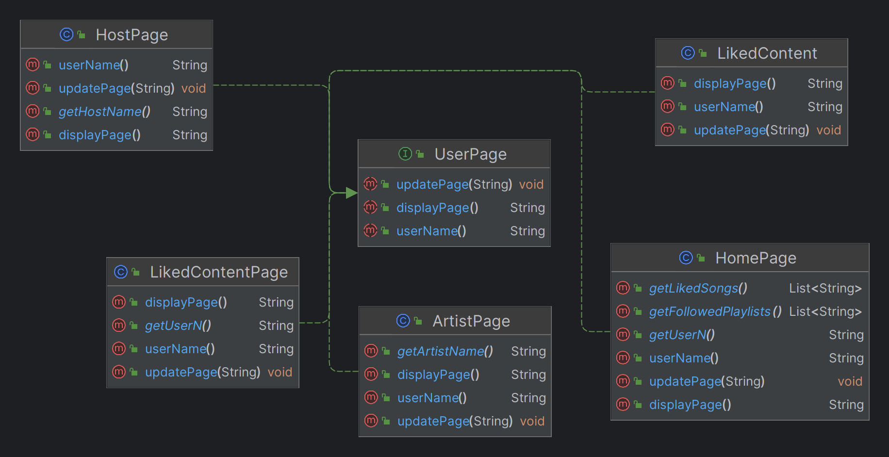
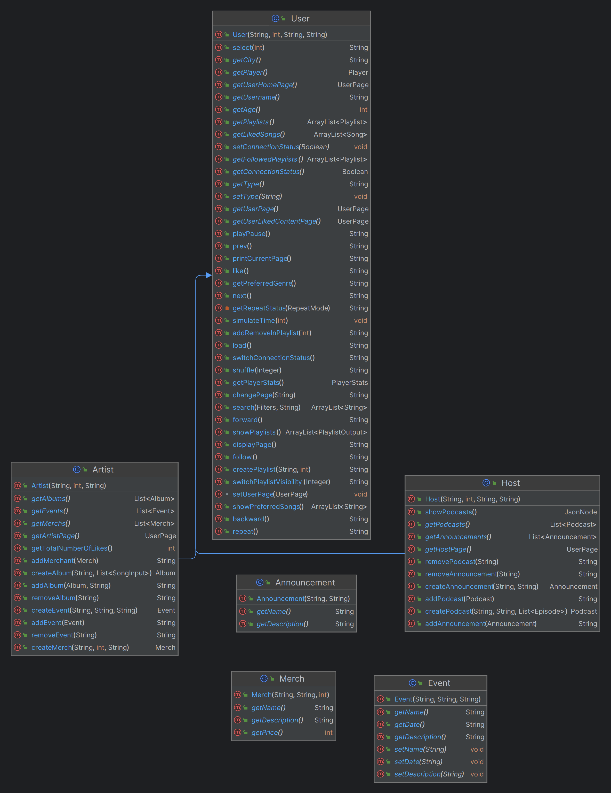
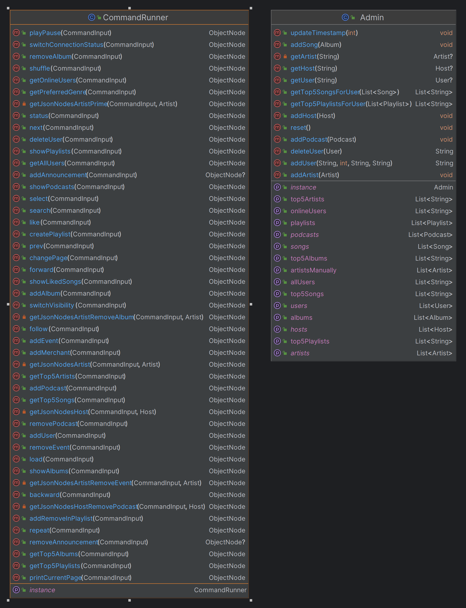
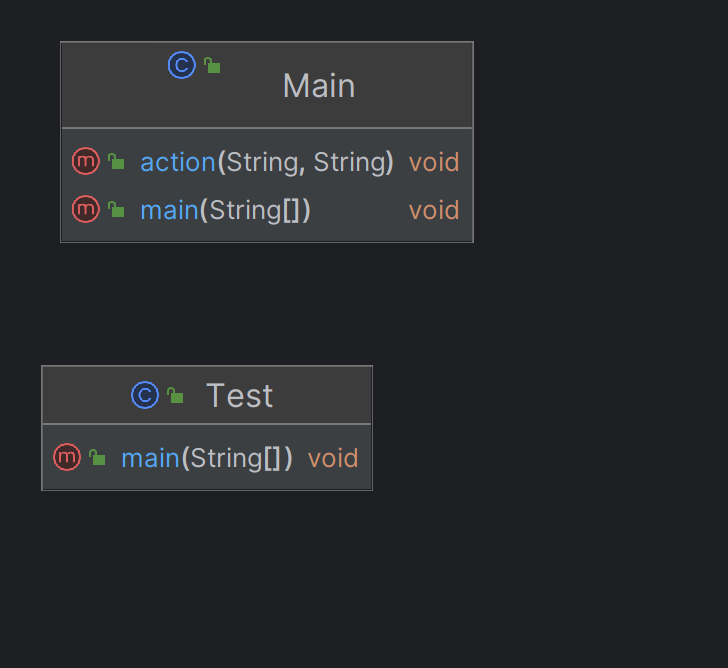

# Proiect GlobalWaves  - Etapa 2

<div align="center"></div>

#### Assignment Link: [https://ocw.cs.pub.ro/courses/poo-ca-cd/teme/proiect/etapa1](https://ocw.cs.pub.ro/courses/poo-ca-cd/teme/proiect/etapa1)


## Skel Structure

* src/
  * checker/ - checker files
  * fileio/ - contains classes used to read data from the json files
  * main/
      * Main - the Main class runs the checker on your implementation. Add the entry point to your implementation in it. Run Main to test your implementation from the IDE or from command line.
      * Test - run the main method from Test class with the name of the input file from the command line and the result will be written
        to the out.txt file. Thus, you can compare this result with ref.
* input/ - contains the tests and library in JSON format
* ref/ - contains all reference output for the tests in JSON format

<div align="center"></div>

# ////////////////////////////////////////////////////////////////////////////////
# HERE STARTS MY README

# SPOTIFY CLONE

Application similar in functionalities 
to Spotify. It simulates various user actions, now including artists and hosts 
(presented below). These actions are simulated using commands received in
input files. The administrative perspective over users and application elements
remains unchanged.

## Application structure


The application is organized into the following components:

### 1. User Management

- **Admin:** Handles users, playlists, podcasts, albums, artists, hosts. 
Includes Operations like delete user, add user. This is a *singleton* class and it is *static*.
- **Command Runner:** Execute commands from users.

### 2. Music Content

- **Artists:** Manages information related to artists, including profiles, albums, and tracks.
- **Playlists:** Handles the playlists.
- **Albums:** Handles adding songs and grouping them.
- **Events:** events planned by artist, contains date, description.
- **Merch:** merchandise.

### 3. Host Features

- **Hosts:** Hosts have podcasts and announcements.
- **Podcasts:** Collections of episodes.
- **Episodes:** Audio files
- **Announcements:** messages


### 4. Interaction and Analytics

- **User Interaction:** Features facilitating user interaction, such as comments, likes, and shares.
- **Analytics:** Provides insights into user behavior, popular tracks, playlists, albums.

### 5. Scheme:












## NOTE !!!!!!!

I have the following checkstyle error:

C:\Users\Maria\IdeaProjects\tema2_etapa2\oop-project-2023\etapa2\.\src\app\player\Player.java:186:32: Parameter time should be final.

I want to show you that this is wrong as the method is the following:
```
public void simulatePlayer(int time) {
        if (!paused) {
            while (time >= source.getDuration()) {
                time -= source.getDuration(); // parameter changes here
                                              // should not be final
                next();
                if (paused) {
                    break;
                }
            }
            if (!paused) {
                source.skip(-time);
            }
        }
    }
```